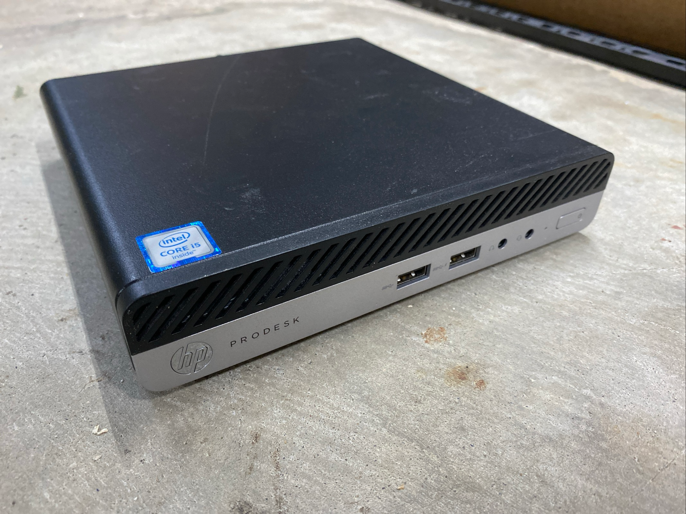

I picked up about 40 of these from a local source and sold most of them, but kept a few for this lab. They can be had for ariybd $30 USD, and mine have 8GB of DDR4 RAM and some used 256GB assorted brand NVMe drives. I have dedicated (2) G3 600 i3-6100T for routing and storage, and (2) G3 400 i5-6500T (pictured) as general purpose server nodes. I'll add more details here later, but my main reasoning for using them is 1. they are cheap and 2. typically only draw 15W.